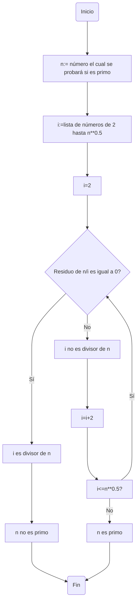
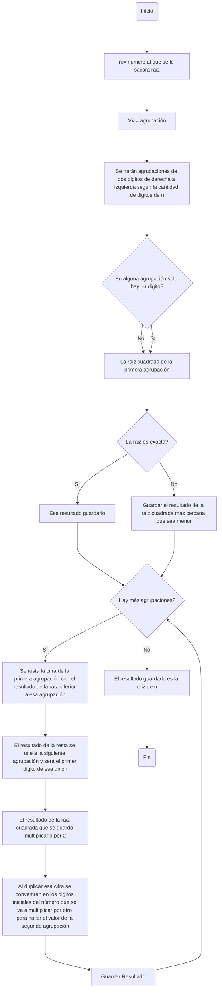

# Reto_3_DosPuntosDeVista
En este repo se hará el reto 3.
## Reto 3
El reto 3 consiste en hacer un diagrama de flujo y el psudocode de los respectivos ejercicios:
1. Plantear el algoritmo para saber si un número es primo.
2. Plantear el procedimiento matemático para hallar raices cuadradas.
---
### Procedimiento para saber si un número es primo
#### Diagrama de Flujo
Primero vamos a hacer el diagrama de flujo para que a la hora de hacer el psudocode sea mucho más fácil.

#### Pseudocode
El pseudocode del problema sería el siguiente:
```pseudocode
[variables]
n : entero
i : número entero de lista
Inicio
  i := 2
  mientras(i<=(n**0.5)) hacer
  Si módulo(n,i) == 0 entonces
    escribir("n no es un número primo")
  Sino
    escribir("i no es divisor de n")
  i := i + 1
  Fin mientras
  escribir("i es un número primo")
Fin
```
### Procedimiento para hallar Raices Cuadradas
#### Diagrama de Flujo
Primero vamos a hacer el diagrama de flujo:

#### Pseudocode
Después del diagrama de flujo procedemos a hacer el pseudocode.
```Pseudocode
[Variables]
n:=Número entero positivo al que se le sacará raiz cuadrada
Vx:=Agrupación
x:=Número de la agrupación
D:=Digito
Inicio
  Vx(2D)
  Formar Vx de derecha a izquierda 
  Agrupación(2D-1D)
  Mientras (Vx) hacer
    Si Raiz Cuadrada exacta (Vx1) == True entonces
      Guardar(resultado)
    Sino
      Resolver (Vx1 > Raiz cuadrada exacta más cercana)
      Guardar(resultado)
      Resta(Vx1,Raiz cuadrada exacta más cercana)
      Unir D (Resultado Resta,Vx2)
      Duplicar(Resultado) == Resultado Duplicado
      Unir(Resultado Duplicado, D) == Resultado union
      Multiplicar(Resultado union, D)
  Fin mientras
Fin
```
### Ese Fue el Reto 3, espero haya sido de su agrado
*Mario Alejandro Martinez Bedoya*
