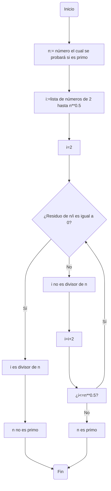

# Reto_3_DosPuntosDeVista
En este repo se hará el reto 3.
## Reto 3
El reto 3 consiste en hacer un diagrama de flujo y el psudocode de los respectivos ejercicios:
1. Plantear el algoritmo para saber si un número es primo.
2. Plantear el procedimiento matemático para hallar raices cuadradas.
---
### Procedimiento para saber si un número es primo
#### Diagrama de Flujo
Primero vamos a hacer el diagrama de flujo para que a la hora de hacer el psudocode sea mucho más fácil.

#### Pseudocode
El pseudocode del problema sería el siguiente:
#### Psudo
